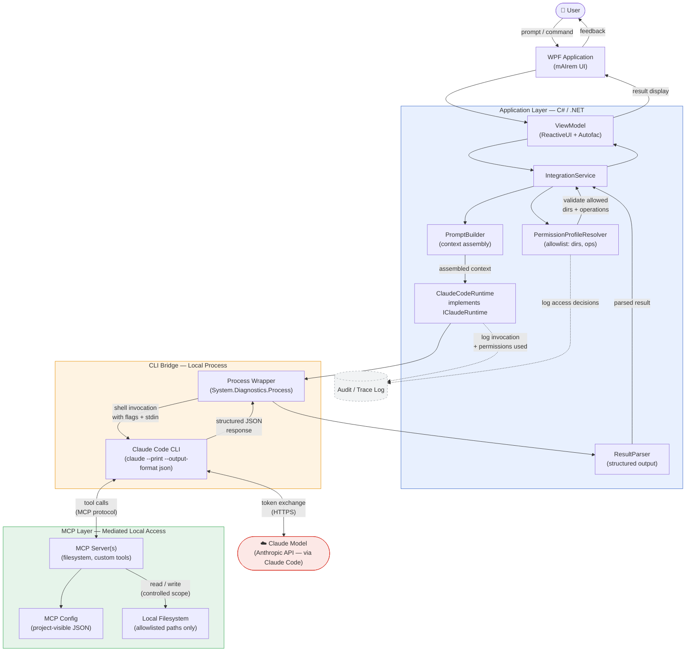
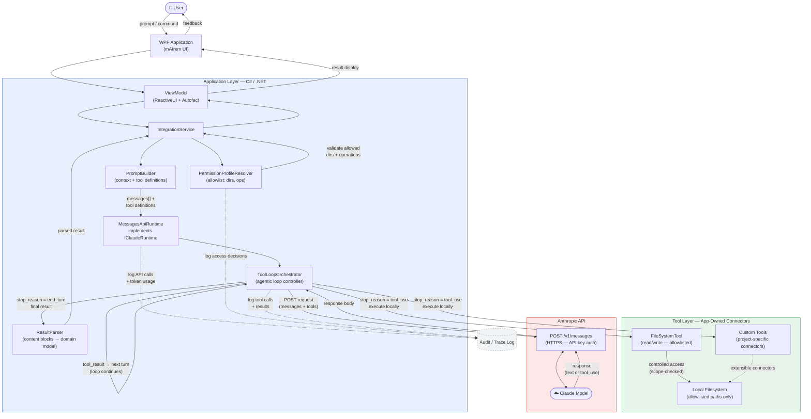

# Architecture — mAIrem Claude Integration Studio

**Project:** `mairem_claude_integration_studio`
**Version:** 1.0.0
**Framework:** C# / .NET · WPF · MkDocs Material
**Date:** 2026-03-30

---

## Overview

This document describes the runtime architecture for integrating the mAIrem
WPF application with the Claude model through two approved paths.

Before reading the diagrams, it is essential to understand three distinct
concepts that this architecture treats as separate layers:

---

## Conceptual model — three layers that must never be conflated

### 1. The model

The **Claude model** is a remote inference engine hosted by Anthropic.
It receives a sequence of messages and returns a response. The model has
no inherent access to the local machine. Any information about the local
environment that the model "sees" was explicitly included in the prompt
by the application layer.

### 2. The client / runtime

The **client or runtime** is the component responsible for sending requests
to the model and receiving responses. In Phase 1 this is the **Claude Code
CLI**, invoked as a subprocess by the C# application. In Phase 2 this is
the **MessagesApiRuntime**, an in-process component that calls the Anthropic
Messages API directly over HTTPS.

The client/runtime is the only component that communicates with the model.
It acts as a controlled gateway — not a transparent pipe.

### 3. MCP / tools

**MCP (Model Context Protocol)** is a protocol that allows the model to
request the execution of named tools during a conversation. The tools
themselves run locally, managed by MCP servers registered in a
project-visible configuration file. In Phase 2, equivalent functionality
is provided by **app-owned tool connectors** managed by the
`ToolLoopOrchestrator`.

In both paths, tool execution is triggered by the model's response but
**controlled and executed entirely by the application**. The model does
not execute code or access files. It requests an action; the application
decides whether and how to fulfill it.

---

## Access control principle

Local file and directory access is **never unrestricted**. All access is:

- defined by a `PermissionProfileResolver` that maintains an allowlist
  of approved directories and operations
- enforced before any tool call or CLI invocation is initiated
- logged to an audit trail regardless of outcome

The model only receives the result of an allowed, executed operation —
it never holds a filesystem handle or session.

---

## Integration path comparison

| Dimension | Path 1 — Claude Code CLI | Path 2 — Messages API |
|---|---|---|
| Runtime process | External subprocess (Claude Code CLI) | In-process HTTP client |
| Model access | Via Claude Code (proxied) | Direct HTTPS to `/v1/messages` |
| MCP / tool execution | Delegated to Claude Code + MCP servers | App-owned `ToolLoopOrchestrator` |
| Local file access | Allowlisted via MCP server config | Allowlisted via app tool connectors |
| Structured output | `--output-format json` flag | `content[]` block parsing |
| Replaceability | CLI layer is intentionally isolated | Runtime implements `IClaudeRuntime` |
| Phase | Phase 1 — approved | Phase 2 — planned |

---

## Runtime abstraction boundary

Both paths are hidden behind a common interface:

```csharp
public interface IClaudeRuntime
{
    Task<ClaudeResult> InvokeAsync(ClaudeRequest request, CancellationToken ct);
}
```

This ensures that the ViewModel, IntegrationService, and PromptBuilder are
**independent of the underlying runtime path**. Switching from Claude Code
to Messages API is a dependency injection configuration change, not an
architectural rewrite.

---

## Path 1 — Claude Code CLI + MCP integration flow

> **Source file:** `docs/diagrams/source/claude_code_integration_flow.mmd`



---

## Path 2 — Messages API + app-owned tool loop flow

> **Source file:** `docs/diagrams/source/messages_api_integration_flow.mmd`



---

## Service responsibilities

| Component | Layer | Responsibility |
|---|---|---|
| `IClaudeRuntime` | Application | Abstract boundary isolating runtime path from business logic |
| `ClaudeCodeRuntime` | Application | Wraps Claude Code CLI subprocess invocation |
| `MessagesApiRuntime` | Application | Calls Anthropic `/v1/messages` directly over HTTPS |
| `PromptBuilder` | Application | Assembles context, system prompt, and tool definitions |
| `PermissionProfileResolver` | Application | Enforces directory/operation allowlist before any invocation |
| `ToolLoopOrchestrator` | Application | Manages the agentic tool-use loop for Messages API path |
| `ResultParser` | Application | Converts raw CLI output or API response blocks to domain model |
| MCP Config JSON | Config | Declares MCP server registrations for Claude Code path |
| MCP Server(s) | CLI Bridge | Execute tool calls on behalf of Claude Code (allowlisted scope) |
| App Tool Connectors | Tool Layer | Execute tool calls on behalf of Messages API path |

---

## External dependencies (Phase 1)

| Dependency | Type | Justification |
|---|---|---|
| Claude Code CLI | Local binary | Required runtime bridge for Phase 1 MCP-capable integration |
| Anthropic API | HTTPS endpoint | Remote model inference — accessed via Claude Code in Phase 1 |
| MCP Server(s) | Local process | Controlled tool execution layer registered in project config |

## External dependencies (Phase 2, planned)

| Dependency | Type | Justification |
|---|---|---|
| Anthropic Messages API | HTTPS endpoint | Direct model access, replacing Claude Code subprocess |
| `Anthropic.SDK` or `HttpClient` | NuGet / stdlib | HTTP client for API calls |

---

## Known constraints

- Claude Code CLI must be installed and available on the local `PATH` for Phase 1.
- MCP server registration must use a project-visible JSON config file —
  hidden or undocumented machine state is not acceptable.
- The `IClaudeRuntime` boundary must be preserved when Phase 2 is implemented.
  Do not bypass it with direct API calls from UI or ViewModel code.
- Messages API does not provide native MCP client behavior. Local tool
  access in Phase 2 is fully owned and mediated by the application.
