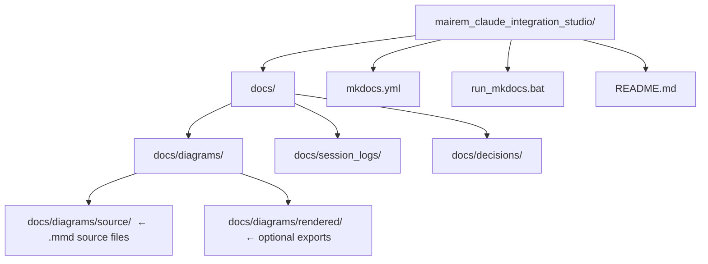

# mAIrem Claude Integration Studio

> **Project:** `mairem_claude_integration_studio` · **Domain:** `AIAutomation\mAIrem`
> **Version:** 1.0.0 · **Created:** 2026-03-30

A governed C# / WPF application that integrates the **mAIrem** desktop
environment with the **Claude** AI model through two distinct runtime paths.
The project is documentation-first: architecture, runtime comparison, and
integration contracts are defined and validated before broad implementation.

---

## Purpose

mAIrem Claude Integration Studio provides a structured, auditable bridge
between the mAIrem WPF application and the Claude model. It defines:

- how user prompts are assembled and routed to Claude
- how Claude's responses are parsed and surfaced in the UI
- how access to local files and tools is mediated and controlled by the
  application layer — never granted directly to the model
- how the integration path can migrate from Phase 1 to Phase 2 without
  breaking the application architecture

---

## Approved integration paths

### Path 1 — Claude Code CLI with MCP (Phase 1 — active)

The application invokes the **Claude Code CLI** as a local subprocess.
Claude Code acts as the runtime bridge between the C# application and the
Claude model. MCP (Model Context Protocol) servers registered in a
project-visible configuration file provide controlled access to local
tools and directories.

**Access to local resources is mediated through the MCP layer**, governed
by an allowlist maintained by the application. The model does not interact
with the local filesystem directly.

→ See [Architecture](architecture.md) for the full runtime diagram.

### Path 2 — Messages API with app-owned tool loop (Phase 2 — planned)

The application calls the **Anthropic Messages API** directly via HTTPS.
An in-process orchestrator manages the agentic tool loop: tool calls
returned by the model are intercepted, executed locally by app-owned
connectors, and the results are fed back as the next conversation turn.

**Access to local resources is entirely mediated by the application.**
No external runtime process is involved.

→ See [Architecture](architecture.md) for the full runtime diagram.

---

## Project structure

---

## Phase status

| Phase | Description | Status |
|---|---|---|
| Phase 1 | Project definition, documentation scaffold, runtime architecture comparison | ⏳ In progress |
| Phase 2 | Claude Code CLI integration — C# implementation | 🔲 Pending |
| Phase 3 | Messages API integration — C# implementation | 🔲 Pending |
| Phase 4 | Hardening, audit, and production readiness | 🔲 Pending |

---

## Key governance rules

- Markdown files in `docs/` are the source of truth for all architecture
  and runtime decisions.
- All diagrams must have a `.mmd` source file in `docs/diagrams/source/`.
- `mkdocs.yml` nav must always match the real `docs/` file set.
- The model does not access local resources directly. All access is
  mediated and allowlisted by the application or runtime layer.
- CLI-specific behavior must not leak into the broader application architecture.
